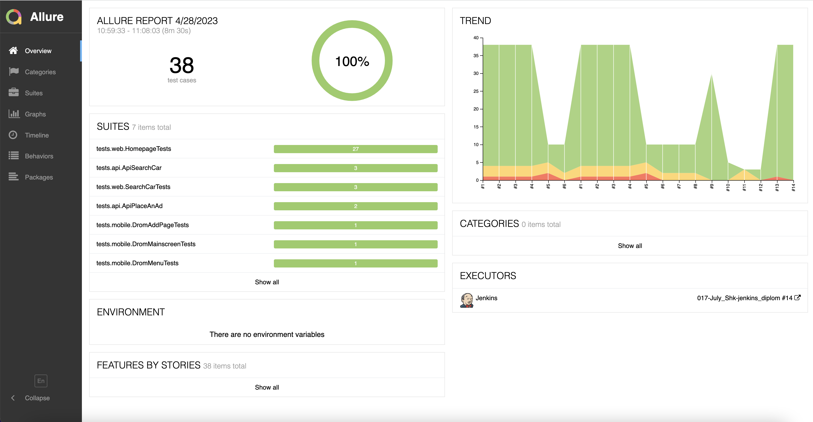
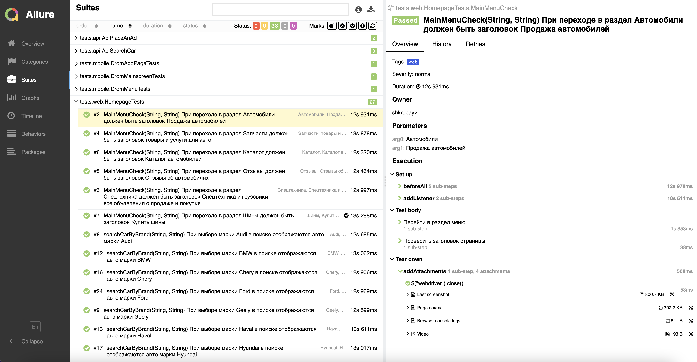
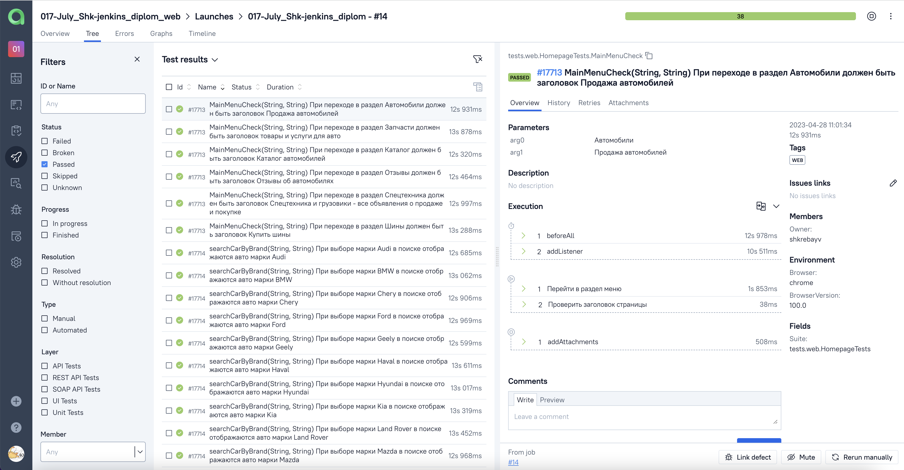
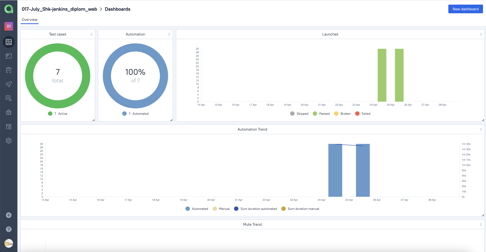

<p  align="center">
<a href="https://drom.ru.ru/"></a>
</p>
<h1  align="center">
# Проект по автоматизации тестирования сайта <a href="https://drom.ru.ru/">Drom.ru</a></h1>


## :receipt: Содержание:

* <a href="#description">Описание</a>
* <a href="#tools">Технологии и инструменты</a>
* <a href="#cases">Реализованные проверки</a>
* <a href="#console">Запуск тестов из терминала</a>
* <a href="#jenkins">Запуск тестов в Jenkins</a>
* <a href="#allure">Отчеты в Allure</a>
* <a href="#testops">Интеграция с Allure TestOps</a>
* <a href="#telegram">Уведомления в Telegram с использованием бота</a>
* <a href="#selenoidvideo">Видео прохождения теста в Selenoid</a>
* <a href="#browserstackvideo">Видео прохождения теста в Browserstack</a>

<a id="description"></a>

## Описание

Данный проект состоит из автоматизированных:

* UI-тестов для веб-приложения
* тестов для API
* мобильных тестов приложения для Android

<a id="tools"></a>

## :computer: Технологии и инструменты

<p align="center">
<a href="https://www.jetbrains.com/idea/"></a>
<a href="https://www.java.com/"></a>
<a href="https://github.com/"></a>
<a href="https://junit.org/junit5/"></a>
<a href="https://gradle.org/"></a>
<a href="https://selenide.org/"></a>
<a href="https://aerokube.com/selenoid/"></a>
<a href="https://github.com/allure-framework/allure2"></a>
<a href="https://https://qameta.io/"></a>
<a href="https://www.jenkins.io/"></a>
<a href="https://https://telegram.org/"></a>
<a href="https://rest-assured.io/"></a>
<a href="https://developer.android.com/studio/"></a>
<a href="http://appium.io/"></a>
<a href="http://appium.io/"></a>
<a href="https://www.browserstack.com/"></a>
</p>

Автотесты написаны на <code>Java</code> с использованием <code>JUnit 5</code> и <code>Gradle</code>, применены различные
библиотеки и фреймворки.

Также реализована сборка в <code>Jenkins</code> с формированием Allure-отчета и отправкой уведомления с результатами
в <code>Telegram</code> после завершения прогона.
В качестве системы управления тестированием выбран <code>Allure TestOps</code>.

Allure-отчет включает в себя:

* шаги выполнения тестов;
* скриншот страницы в браузере в момент окончания автотеста;
* Page Source;
* логи браузерной консоли;
* видео выполнения автотеста.

### Для UI-тестов

* при написании использован фреймворк [Selenide](https://selenide.org/)
* запуск осуществляется локально или с помощью [Selenoid](https://aerokube.com/selenoid/).

### Для API-тестов

* при написании использована библиотека [REST Assured](https://rest-assured.io)
* для сокращения шаблонного кода применена библиотека [Lombok](https://projectlombok.org/)

### Для mobile-тестов

* при написании использован фреймворк с открытым исходным кодом [Appium](https://appium.io)
* для просмотра и взаимодействия с элементами интерфейса
  выбран [Appium Inspector](https://github.com/appium/appium-inspector)
* запуск может осуществляться локально в эмуляторе [Android Studio](https://developer.android.com/studio)
* удаленный запуск осуществляется с помощью фермы реальных мобильных
  устройств [Browserstack](https://app-automate.browserstack.com/)


<a id="cases"></a>

## :mag_right: Реализованные проверки

Автоматизированные проверки UI
- ✓ Проверка списка популярных марок автомобилей на главной странице
- ✓ Классификация автомобилей в секции 'Новые автомобили от дилеров'
- ✓ Проверка перехода в нужный раздел при выборе пункта меню
- ✓ Проверка поиска автомобилей марки, выбранной на главной странице
- ✓ Проверка формы поиска автомобиля
- ✓ Проверка поиска автомобиля по марке
- ✓ Проверка поиска новых автомобилей

Автоматизированные проверки API
- ✓ Проверка запроса поиска всех автомобилей (GET)
- ✓ Добавление объявления о продаже автомобиля в избранное (POST)
- ✓ Удаление объявления о продаже автомобиля из избранного (POST)
- ✓ Переход к заполнению формы подачи объявления (GET)
- ✓ Ошибка при переходе к заполнению формы подачи объявления (GET)

Автоматизированные проверки MOBILE APP
- ✓ Проверка разделов на главном экране приложения
- ✓ Проверка пунктов меню
- ✓ Проверка разделов при подаче объявления о продаже

<a id="console"></a>

## :arrow_forward: Запуск тестов

### Локальный запуск тестов

#### Для UI-тестов
```bash
gradle clean web -Denv=local 
```

#### Для API-тестов
```bash
gradle clean api
```

#### Для MOBILE-тестов
```bash
gradle clean mobile -DdeviceHost=emulator
```
<a id="jenkins"></a>

###  <a> Удаленный запуск (в Jenkins): </a>
1. Открыть <a target="_blank" href="https://jenkins.autotests.cloud/job/017-July_Shk-jenkins_diplom/">проект</a>


2. Выбрать пункт **Собрать с параметрами**
3. Для запуска ui-тестов необходимо в <code>TYPE</code> выбрать <code>web</code> и указать параметры для сборки <code>BROWSER_NAME</code>, <code>BROWSER_VERSION</code>, <code>BROWSER_SIZE</code>, <code>REMOTE_URL</code> либо оставить их заполненными по умолчанию
4. Для запуска api-тестов необходимо в <code>TYPE</code> выбрать <code>api</code>, а остальные поля оставить заполненными по умолчанию
5. Для запуска molile-тестов необходимо в <code>TYPE</code> выбрать <code>mobile</code> и указать параметр для сборки <code>DEVICE_HOST</code>
6. Для запуска всех тестов необходимо в <code>TYPE</code> выбрать <code>test</code>
7. Нажать **Собрать**
8. Результат запуска сборки можно посмотреть в отчёте Allure

<a id="allure"></a>

## </a> Отчет в <a target="_blank" href="https://jenkins.autotests.cloud/job/017-July_Shk-jenkins_diplom_web/8/allure/">Allure report</a>

###  Главное окно

<p align="center">

</p>

###  Тесты

<p align="center">

</p>

<a id="testops"></a>

## </a> Интеграция с <a target="_blank" href="https://allure.autotests.cloud/launch/22930">Allure TestOps</a>
### Общий список всех кейсов
<p align="center">

</p>

### Dashboard с общими результатами тестирования
<p align="center">

</p>

<a id="telegram"></a>

## </a> Уведомление в Telegram о результатах прогона тестов

<p align="center">

</p>

<a id="selenoidvideo"></a>

## </a> Видео прохождения тестов в Selenoid

<p align="center">
  
</p>

<a id="browserstackvideo"></a>

## </a> Видео прохождения тестов в Browserstack

<p align="center">
  
</p>